# Maven Build Automation: A Comprehensive Guide

Build automation is a cornerstone of modern DevOps, continuous integration, and software engineering. Among the various tools that have shaped the Java ecosystem, **Apache Maven** stands out as a pioneering and widely adopted build automation and project management tool.

This document provides a detailed exploration of build automation concepts, the exact problems it solves, the architecture of Maven's **Project Object Model (POM)**, and Maven's **Standard Directory Structure**.

---

## 1. Why Build Tools Exist

In the early days of software engineering, compiling a program was simple: a developer ran a compiler command on a single source file (e.g., `javac HelloWorld.java`) and ran the resulting executable. However, as applications grew, several complexities emerged:

*   **Massive Codebases:** Modern applications contain hundreds or thousands of source files. Compiling them manually or via basic scripts becomes highly inefficient and error-prone.
*   **Complex Compilation Dependencies:** Source files depend on other source files. If file `A.java` uses class `B.java`, `B` must be compiled before `A`. Tracking this compilation order manually is incredibly difficult.
*   **External Dependencies (Libraries):** Modern software is rarely written from scratch. Developers rely on third-party libraries (e.g., Spring, Hibernate, JUnit, Jackson). Locating, downloading, adding them to the classpath, and keeping track of their versions is highly tedious.
*   **Diverse Build Steps:** Building a modern application involves much more than just compilation. It includes:
    *   Cleaning prior build artifacts.
    *   Running unit, integration, and functional tests.
    *   Generating documentation (Javadoc, reports).
    *   Packaging code into distributable formats (JAR, WAR, EAR, ZIP).
    *   Validating code quality and security metrics.
    *   Deploying artifacts to local or remote repositories (Artifactory, Nexus, Maven Central).

**Build tools exist to translate these complex, multi-step, error-prone manual operations into a standardized, repeatable, and single-command automated process.**

---

## 2. Problems Solved by Automated Builds

Without automated build tools, development teams face massive inefficiencies. Build automation directly addresses and solves the following critical problems:

### A. The "Works on My Machine" Syndrome
*   **Problem:** Developers configure their local environments differently (different library versions, different local paths, different compiler settings). A project built successfully on Developer A's computer might fail on Developer B's computer or the production server.
*   **Solution:** Automated build tools define the exact compiler settings, source configurations, and dependency versions declaratively in a configuration file. This guarantees that the build behaves identically on any machine—whether it is a local laptop, a CI/CD server, or a production environment.

### B. Dependency Hell and Transitive Dependencies
*   **Problem:** If your project depends on Library $X$, and Library $X$ depends on Library $Y$ (version 2.0), you must manually download both. If another dependency $Z$ requires Library $Y$ (version 1.5), a classpath conflict arises. Resolving these "transitive dependencies" manually is a notorious nightmare.
*   **Solution:** Build tools like Maven feature robust **Dependency Resolution Engines**. They automatically construct a dependency tree, download required files from centralized remote repositories, resolve version conflicts using deterministic algorithms (such as Maven's *Nearest-Definition* rule), and configure the runtime/compile classpaths automatically.

### C. Inefficient and Time-Consuming Manual Execution
*   **Problem:** Manually executing tests, packing files, moving them to server directories, and restarting databases takes significant developer time and invites human error.
*   **Solution:** A single command (e.g., `mvn clean install`) automates the entire lifecycle. This enables seamless integration with **Continuous Integration (CI)** systems like Jenkins, GitLab CI, or GitHub Actions, which build and test code automatically on every single commit.

### D. Lack of Standardization
*   **Problem:** Without a standard structure, every developer organizes files in their own preferred way. A new developer joining a team spends days or weeks just understanding where source files, configurations, resources, and tests are stored.
*   **Solution:** Standardized build tools enforce a uniform directory structure and development lifecycle across all projects in an organization or community, drastically reducing onboarding time.

---

## 3. Project Object Model (POM)

In Apache Maven, the **Project Object Model (POM)** is the fundamental unit of work. It is an XML file named `pom.xml` situated in the root directory of the project. 

The POM is entirely **declarative**. Instead of writing scripts that tell the tool *how* to build the project step-by-step (imperative styling, like in Make or Ant), the POM describes *what* the project is, its dependencies, its metadata, and its plugins. Maven then configures the build steps based on its own conventions.

### Core Elements of `pom.xml`

#### 1. Maven Coordinates (GAV)
Every Maven artifact must be uniquely identifiable. This is achieved using three primary coordinates, known collectively as **GAV**:
*   `groupId`: Identifies the organization, group, or company (e.g., `com.example`, `org.apache.maven`). It usually follows Java package naming conventions.
*   `artifactId`: The unique name of the project or module artifact (e.g., `user-service`, `core-utils`).
*   `version`: The specific version of the project (e.g., `1.0.0`, `2.1.4-SNAPSHOT`). The `-SNAPSHOT` suffix indicates that the project is in active development and is not yet a stable release.

#### 2. Packaging
Defines the output format of the build. Common formats include:
*   `jar` (Default): Java Archive, standard for console applications or backend services.
*   `war`: Web Application Archive, used for deployment inside servlet containers (like Tomcat or Jetty).
*   `pom`: A metadata-only project, often used as a parent POM to manage dependencies for multi-module projects.

#### 3. Dependencies & Scopes
Dependencies represent external libraries required to compile or run the application. Each dependency is defined using its GAV coordinates and a **Scope** which restricts when the dependency is present on the classpath:

| Scope | Description | Examples |
| :--- | :--- | :--- |
| **`compile`** | *Default scope.* Available on all classpaths (compilation, testing, execution). It is transitively propagated to dependent projects. | `org.slf4j:slf4j-api` |
| **`provided`** | Required for compilation and testing, but **not** packaged because the target JDK or runtime container (e.g., Tomcat) already provides it. | `jakarta.servlet:jakarta.servlet-api` |
| **`runtime`** | Not needed for compilation, but required during execution/testing. | JDBC Drivers (e.g., `postgresql`) |
| **`test`** | Only required to compile and run tests. It is never packaged into the final artifact. | `org.junit.jupiter:junit-jupiter` |
| **`system`** | Similar to `provided`, but you must provide an explicit path to a local JAR file. *(Deprecated and highly discouraged).* | Local custom legacy JARs |

#### 4. Properties
User-defined placeholders that help avoid hardcoding and maintain consistency (e.g., defining a compiler version or library version in one place and referencing it multiple times).

#### 5. Plugins
Plugins are the engines of Maven. Maven itself is a thin core; almost all actual tasks (compiling, testing, packaging) are delegated to plugins.
*   *Example:* `maven-compiler-plugin` specifies the source and target Java versions.
*   *Example:* `maven-surefire-plugin` executes Unit Tests.

---

### Detailed Example of a standard `pom.xml`

Below is an annotated, production-grade `pom.xml` showcasing these concepts:

```xml
<?xml version="1.0" encoding="UTF-8"?>
<project xmlns="http://maven.apache.org/POM/4.0.0"
         xmlns:xsi="http://www.w3.org/2001/XMLSchema-instance"
         xsi:schemaLocation="http://maven.apache.org/POM/4.0.0 
                             https://maven.apache.org/xsd/maven-4.0.0.xsd">
    
    <!-- Model Version (always 4.0.0 for Maven 2 and 3) -->
    <modelVersion>4.0.0</modelVersion>

    <!-- 1. Maven Coordinates (GAV) -->
    <groupId>com.edu.devops</groupId>
    <artifactId>maven-demo-app</artifactId>
    <version>1.0-SNAPSHOT</version>
    
    <!-- 2. Packaging Type -->
    <packaging>jar</packaging>

    <!-- Project Metadata -->
    <name>Maven Demo Application</name>
    <description>An educational project demonstrating Maven features</description>

    <!-- 3. Properties: Centralized Configuration Variables -->
    <properties>
        <maven.compiler.source>17</maven.compiler.source>
        <maven.compiler.target>17</maven.compiler.target>
        <project.build.sourceEncoding>UTF-8</project.build.sourceEncoding>
        <junit.version>5.10.1</junit.version>
        <jackson.version>2.16.0</jackson.version>
    </properties>

    <!-- 4. Dependencies Configuration -->
    <dependencies>
        <!-- Compile Scope: Required for compiling and running the application -->
        <dependency>
            <groupId>com.fasterxml.jackson.core</groupId>
            <artifactId>jackson-databind</artifactId>
            <version>${jackson.version}</version>
            <scope>compile</scope>
        </dependency>

        <!-- Runtime Scope: Only needed when executing, e.g., database drivers -->
        <dependency>
            <groupId>org.postgresql</groupId>
            <artifactId>postgresql</artifactId>
            <version>42.7.1</version>
            <scope>runtime</scope>
        </dependency>

        <!-- Test Scope: Only available during compile-test and execution-test phases -->
        <dependency>
            <groupId>org.junit.jupiter</groupId>
            <artifactId>junit-jupiter-api</artifactId>
            <version>${junit.version}</version>
            <scope>test</scope>
        </dependency>
        <dependency>
            <groupId>org.junit.jupiter</groupId>
            <artifactId>junit-jupiter-engine</artifactId>
            <version>${junit.version}</version>
            <scope>test</scope>
        </dependency>
    </dependencies>

    <!-- 5. Build and Plugins Configuration -->
    <build>
        <plugins>
            <!-- Compiler Plugin: Sets target JDK and compilation flags -->
            <plugin>
                <groupId>org.apache.maven.plugins</groupId>
                <artifactId>maven-compiler-plugin</artifactId>
                <version>3.11.0</version>
                <configuration>
                    <source>${maven.compiler.source}</source>
                    <target>${maven.compiler.target}</target>
                </configuration>
            </plugin>

            <!-- Surefire Plugin: Responsible for running unit tests -->
            <plugin>
                <groupId>org.apache.maven.plugins</groupId>
                <artifactId>maven-surefire-plugin</artifactId>
                <version>3.2.2</version>
            </plugin>
        </plugins>
    </build>
</project>
```

---

## 4. Maven Standard Directory Structure

Maven operates on the philosophy of **"Convention over Configuration" (CoC)**. Instead of requiring developers to write configurations explaining where source code, tests, resources, and outputs reside, Maven mandates a strict standard directory structure.

If you respect this layout, Maven builds the project out-of-the-box with **zero** custom configuration.

### The Complete Directory Layout

Here is the structural schematic of a standard single-module Maven project:

```text
my-maven-project/
├── pom.xml                               # Project configuration (declarative metadata)
├── src/                                  # All project source files live here
│   ├── main/                             # Production code and configuration files
│   │   ├── java/                         # Production Java source files (.java)
│   │   │   └── com/
│   │   │       └── example/
│   │   │           └── App.java          # e.g., Application main class
│   │   ├── resources/                    # Non-Java application resources (properties, XML, JSON, SQL scripts)
│   │   │   ├── application.properties
│   │   │   └── logback.xml
│   │   └── webapp/                       # Web application assets (HTML, CSS, JS, JSP, WEB-INF) - used in WAR packaging
│   │       ├── WEB-INF/
│   │       │   └── web.xml
│   │       └── index.html
│   └── test/                             # Test code and test-specific resources
│       ├── java/                         # Unit and integration test Java files (.java)
│       │   └── com/
│       │       └── example/
│       │           └── AppTest.java      # JUnit/TestNG tests
│       └── resources/                    # Test-only resources (mock configurations, test datasets)
│           └── test-data.json
└── target/                               # Maven-created folder containing build outputs (automatically generated)
    ├── classes/                          # Compiled production class files (.class)
    ├── test-classes/                     # Compiled test class files (.class)
    ├── surefire-reports/                 # XML and text reports of test executions
    └── maven-demo-app-1.0-SNAPSHOT.jar   # The final distributable archive (JAR or WAR)
```

### Detailed Breakdown of Directories

*   **`src/main/java`**
    *   This folder contains all the Java classes that make up the actual product code of the application. 
    *   Files inside must follow standard Java package naming conventions representing a directory tree (e.g., `com.edu.devops.MyClass` sits in `src/main/java/com/edu/devops/MyClass.java`).
*   **`src/main/resources`**
    *   Non-Java configuration files and static content.
    *   Files in this folder are placed directly into the root classpath of the compiled artifact. For instance, `src/main/resources/config.properties` can be loaded at runtime using `getClass().getClassLoader().getResourceAsStream("config.properties")`.
*   **`src/main/webapp`**
    *   Only used if the project packaging is set to `war`. It contains web elements like JSP pages, client-side files (HTML, CSS, JS), and the traditional deployment descriptor file `web.xml` under `WEB-INF/`.
*   **`src/test/java`**
    *   Contains unit and integration test scripts (e.g., JUnit 5 classes).
    *   These tests are compiled and executed during the build, but they are completely ignored when assembling the final production package (`JAR`/`WAR`).
*   **`src/test/resources`**
    *   Resources utilized exclusively during test execution. Useful for mock responses, database seeds, and test property overrides.
*   **`target/`**
    *   This is Maven's workspace. Everything generated during compilation, testing, packaging, and report generation is dumped here.
    *   **Crucial Practice:** The `target/` directory should *never* be committed to version control systems like Git. You must include it in your `.gitignore` file since it can be regenerated at any time by running `mvn clean` followed by a compilation phase.

---

## 5. Maven Build Lifecycles & Phases

To tie it all together, Maven uses a structured mechanism to execute build actions, consisting of **Lifecycles**, **Phases**, and **Goals**.

### The Three Default Lifecycles
Maven has three built-in build lifecycles:
1.  **`clean`**: Handles project cleaning (deleting the `target` directory to ensure a fresh build).
2.  **`default`** (or **`build`**): Handles the entire project compilation, testing, packaging, and deployment sequence.
3.  **`site`**: Generates project documentation and reports.

### Key Phases of the `default` Lifecycle
A lifecycle consists of a sequential list of **Phases**. When you execute a phase, Maven runs every preceding phase in that sequence first. Here is the chronological sequence of the most common phases:

```mermaid
graph LR
    validate[1. validate] --> compile[2. compile]
    compile --> test[3. test]
    test --> package[4. package]
    package --> verify[5. verify]
    verify --> install[6. install]
    install --> deploy[7. deploy]
    
    style validate fill:#e1f5fe,stroke:#0288d1,stroke-width:2px;
    style compile fill:#e1f5fe,stroke:#0288d1,stroke-width:2px;
    style test fill:#e8f5e9,stroke:#2e7d32,stroke-width:2px;
    style package fill:#fff8e1,stroke:#f57f17,stroke-width:2px;
    style verify fill:#fff8e1,stroke:#f57f17,stroke-width:2px;
    style install fill:#ede7f6,stroke:#5e35b1,stroke-width:2px;
    style deploy fill:#ffebee,stroke:#c62828,stroke-width:2px;
```



1.  **`validate`**: Confirms that the project is correct and all necessary information is available.
2.  **`compile`**: Translates Java source files (`src/main/java`) into bytecode (`.class` files in `target/classes`).
3.  **`test`**: Compiles test files and runs unit tests using framework plugins like Surefire.
4.  **`package`**: Converts compiled classes and resources into a distributable format like a JAR or WAR.
5.  **`verify`**: Runs integration tests and checks the quality of packaged code against standards.
6.  **`install`**: Installs the final packaged artifact into your local Maven cache (typically located at `~/.m2/repository`), making it usable as a dependency for other local projects.
7.  **`deploy`**: Copies the final artifact to a remote artifact server (like Maven Central, Artifactory, or Nexus) so it can be shared with other developers globally.

*Example command:* 
```bash
mvn clean install
```
This command triggers the `clean` lifecycle (deleting the old `target` directory) and then executes all phases in the `default` lifecycle up to `install` (validating, compiling, testing, packaging, verifying, and installing).
