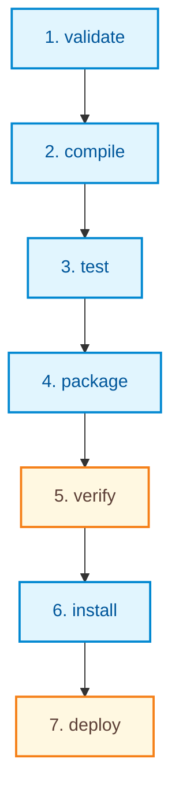

# Deep Dive: Maven Build Lifecycles, Phases, and Parent POMs

This guide provides a comprehensive and technical exploration of Apache Maven's execution model and inheritance mechanisms, focusing on two advanced core concepts:
1. **The Build Lifecycle and its individual Phases** (`validate` to `deploy`).
2. **Parent POMs and Multi-Module structures** (Inheritance, dependency management, and aggregation).

---

## 1. The Maven Build Execution Model

Maven's execution model is built upon three layered abstractions: **Lifecycles**, **Phases**, and **Goals**. 

```text
+-------------------------------------------------------+
|                       LIFECYCLE                       |
|  (e.g., 'default' - handles full project compilation)  |
+---------------------------+---------------------------+
                            |
           consists of an ordered sequence of
                            |
                            v
+-------------------------------------------------------+
|                    LIFECYCLE PHASE                    |
|       (e.g., 'compile', 'test', 'package', 'deploy')  |
+---------------------------+---------------------------+
                            |
              delegates the actual work to
                            |
                            v
+-------------------------------------------------------+
|                      PLUGIN GOAL                      |
|    (e.g., 'compiler:compile', 'surefire:test')       |
+-------------------------------------------------------+
```

*   **Lifecycle:** An overall cohesive process containing several sequential steps. Maven has three built-in lifecycles: `clean` (cleanup), `default` (build & deploy), and `site` (documentation).
*   **Phase:** An individual, ordered step within a lifecycle. Running any phase automatically executes all preceding phases in that lifecycle.
*   **Goal:** The actual executable task bound to a phase. Maven's core is thin; plugins provide goals that bind to phases. A single phase can have zero, one, or multiple goals bound to it.

---

## 2. In-Depth Analysis of Key Build Lifecycle Phases

The standard **`default` (build)** lifecycle contains a series of phases designed to take raw source code and transform it into a tested, verified, packaged, and distributed product. Below is the detailed breakdown of the 7 core phases.



### 1. `validate`
*   **Purpose:** Inspects the project structure, ensures all required configuration parameters are present, and validates the syntax and structure of the `pom.xml`.
*   **Key Operations:**
    *   Verifies if the workspace has correct paths.
    *   Validates maven coordinates and structure.
    *   Ensures that required system environment variables or properties are set.
*   **Default Plugin/Goal Bound:** Typically performs structural checks. If any validation fails, the build terminates immediately before compiling any files.

### 2. `compile`
*   **Purpose:** Compiles the main application production source code.
*   **Key Operations:**
    *   Scans the `src/main/java` directory.
    *   Translates Java source files (`.java`) into JVM bytecode (`.class`).
    *   Copies main resources from `src/main/resources` into the compilation output folder.
*   **Output Directory:** `target/classes/`
*   **Default Plugin/Goal Bound:** `org.apache.maven.plugins:maven-compiler-plugin:compile`

### 3. `test`
*   **Purpose:** Compiles and executes unit tests using testing frameworks (e.g., JUnit, TestNG).
*   **Key Operations:**
    *   Scans the `src/test/java` directory.
    *   Compiles test Java files into test class bytecode.
    *   Copies test resources from `src/test/resources` into the test output folder.
    *   Launches the testing framework to run all assertions.
*   **Output Directory:** `target/test-classes/` (for compiled test code) and `target/surefire-reports/` (for XML/TXT test execution reports).
*   **Default Plugin/Goal Bound:** `org.apache.maven.plugins:maven-surefire-plugin:test`
*   > [!IMPORTANT]
    > By default, if any unit test assertions fail, the build is marked as **failed** and terminates instantly. This prevents broken code from being packaged or distributed. Developers can temporarily skip tests using the flag `-DskipTests`.

### 4. `package`
*   **Purpose:** Bundles the compiled production bytecode and application resources into a distributable archive file based on the `<packaging>` tag in the POM.
*   **Key Operations:**
    *   Gathers the contents of `target/classes/`.
    *   Packages them into a compressed file format.
*   **Output Directory:** `target/[artifactId]-[version].[packaging]` (e.g., `target/auth-service-1.0.0.jar`).
*   **Default Plugin/Goal Bound:** 
    *   For JAR packaging: `maven-jar-plugin:jar`
    *   For WAR packaging: `maven-war-plugin:war`

### 5. `verify`
*   **Purpose:** Performs rigorous checks on the packaged archive to ensure it meets quality, formatting, and functional criteria.
*   **Key Operations:**
    *   Typically used to execute **Integration Tests** (which require the packaged artifact to be running or spun up, e.g., using Testcontainers).
    *   Runs code analysis tools (such as PMD, Checkstyle, SpotBugs, or Jacoco code coverage checking).
*   **Default Plugin/Goal Bound:** `org.apache.maven.plugins:maven-failsafe-plugin:integration-test` & `verify`
*   > [!TIP]
    > Unlike unit tests (which run in the `test` phase and test methods in isolation), integration tests are executed in the `verify` phase because they verify how the fully assembled package interacts with databases, network protocols, or external REST APIs.

### 6. `install`
*   **Purpose:** Publishes the packaged artifact into the local Maven repository on the developer's computer.
*   **Key Operations:**
    *   Copies the package (JAR/WAR) along with its finalized `pom.xml` to the local cache.
*   **Local Repository Path:** Typically `~/.m2/repository/` (Linux/macOS) or `C:\Users\<Username>\.m2\repository\` (Windows).
*   **Default Plugin/Goal Bound:** `org.apache.maven.plugins:maven-install-plugin:install`
*   **Use Case:** This makes your custom project immediately accessible as an external dependency for any *other* Maven project that is compiled locally on your machine.

### 7. `deploy`
*   **Purpose:** Uploads the final packaged artifact and project POM to a remote shared repository (e.g., Nexus, JFrog Artifactory, or Maven Central).
*   **Key Operations:**
    *   Establishes a secure connection with the remote repository.
    *   Uploads the library binaries along with checksums (`.md5`, `.sha1`) and metadata.
*   **Default Plugin/Goal Bound:** `org.apache.maven.plugins:maven-deploy-plugin:deploy`
*   **Use Case:** This is the final step in a continuous delivery pipeline, making the compiled artifact available to the entire development organization or the public.

---

## 3. Parent POM and POM Inheritance

In large enterprise software environments, applications are rarely composed of a single, standalone project. Instead, they are broken down into **multi-module architectures** (microservices, common libraries, web layers, persistence layers). 

This introduces a massive administrative problem: **How do we maintain consistent library versions, compiler settings, and plugin configurations across 50 separate modules?**

Maven solves this via **POM Inheritance** using a **Parent POM**.

```text
                     +---------------------------------+
                     |            Parent POM           |
                     |      (packaging = pom)          |
                     |  - Centralized properties       |
                     |  - dependencyManagement         |
                     |  - pluginManagement             |
                     +----------------+----------------+
                                      |
                                      | Inherits properties, plugins,
                                      | and managed dependencies
                                      v
             +------------------------+------------------------+
             |                                                 |
             v                                                 v
+----------------------------+                    +----------------------------+
|      Child Module A        |                    |      Child Module B        |
|     (packaging = jar)      |                    |     (packaging = war)      |
|  - inherits Parent metadata|                    |  - inherits Parent metadata|
|  - overrides specifically  |                    |  - overrides specifically  |
+----------------------------+                    +----------------------------+
```

### Core Features of Parent POMs

#### A. Dependency Management vs. Dependencies
This is the most critical distinction in Maven architecture:

1.  **`<dependencies>` (Direct Inheritance):** 
    *   Any dependency declared here is **forcibly inherited** by every single child module.
    *   *Best Use Case:* Core utility libraries that *every* module needs without exception (e.g., `lombok` for code generation, or `slf4j` / `logback` for logging).
2.  **`<dependencyManagement>` (Managed Declaration):**
    *   It does **not** actually add the library to the classpath of the parent or any child modules.
    *   Instead, it acts as a **centralized lookup registry** that defines the *version* and *scope* of dependencies.
    *   If a child module wants to use a managed library, it declares the dependency in its own `<dependencies>` section **without specifying the version tag**.
    *   *Best Use Case:* Standardizing versions for Spring, Jackson, or Hibernate. Child modules only import what they actually need, but they are guaranteed to use the exact same, tested version defined in the parent.

#### B. Plugin Management vs. Plugins
Similar to dependencies, plugin configuration is shared via:
1.  **`<build><plugins>`:** Automatically runs the plugin goals during the build of the parent and *all* child modules.
2.  **`<build><pluginManagement>`:** Centralizes the version and configuration of plugins. Child modules only activate the plugin by listing it in their own `<plugins>` block (without version and config tags) if and when they need it.

#### C. POM Aggregation (Modules)
In a parent project directory, the parent POM can define a `<modules>` section listing the relative paths to child directories. 
When you execute a build command (like `mvn clean package`) on the parent root folder, Maven automatically analyzes all child modules, determines the correct compile-dependency order (using **Reactive Build Order**), and builds every module sequentially in a single pass.

---

## 4. Complete Code Templates

### A. Annotated Parent POM Template (`pom.xml`)

Save this in the root directory of a multi-module project:

```xml
<?xml version="1.0" encoding="UTF-8"?>
<project xmlns="http://maven.apache.org/POM/4.0.0"
         xmlns:xsi="http://www.w3.org/2001/XMLSchema-instance"
         xsi:schemaLocation="http://maven.apache.org/POM/4.0.0 
                             https://maven.apache.org/xsd/maven-4.0.0.xsd">
    <modelVersion>4.0.0</modelVersion>

    <!-- Parent GAV coordinates -->
    <groupId>com.enterprise.app</groupId>
    <artifactId>parent-platform</artifactId>
    <version>2.5.0-SNAPSHOT</version>
    
    <!-- 1. Crucial: Parent POM packaging must ALWAYS be 'pom' -->
    <packaging>pom</packaging>

    <name>Enterprise Application Parent Platform</name>

    <!-- 2. Aggregation: Child module directories relative to this file -->
    <modules>
        <module>common-utils</module>
        <module>user-service</module>
        <module>api-gateway</module>
    </modules>

    <!-- 3. Properties shared by all child modules -->
    <properties>
        <maven.compiler.source>17</maven.compiler.source>
        <maven.compiler.target>17</maven.compiler.target>
        <project.build.sourceEncoding>UTF-8</project.build.sourceEncoding>
        
        <!-- Dependency Version Control Centralized -->
        <spring.version>6.1.2</spring.version>
        <jackson.version>2.16.1</jackson.version>
        <junit.version>5.10.1</junit.version>
    </properties>

    <!-- 4. Globally Inherited Dependencies (All child modules automatically get these) -->
    <dependencies>
        <!-- Every module needs logging -->
        <dependency>
            <groupId>org.slf4j</groupId>
            <artifactId>slf4j-api</artifactId>
            <version>2.0.9</version>
        </dependency>
        <!-- Every module needs Lombok -->
        <dependency>
            <groupId>org.projectlombok</groupId>
            <artifactId>lombok</artifactId>
            <version>1.18.30</version>
            <scope>provided</scope>
        </dependency>
    </dependencies>

    <!-- 5. Centralized Dependency Registry (Declared here, imported selective in children) -->
    <dependencyManagement>
        <dependencies>
            <!-- Core Spring framework context -->
            <dependency>
                <groupId>org.springframework</groupId>
                <artifactId>spring-context</artifactId>
                <version>${spring.version}</version>
            </dependency>
            <!-- Core Spring Web dependency -->
            <dependency>
                <groupId>org.springframework</groupId>
                <artifactId>spring-web</artifactId>
                <version>${spring.version}</version>
            </dependency>
            <!-- Jackson Databind library -->
            <dependency>
                <groupId>com.fasterxml.jackson.core</groupId>
                <artifactId>jackson-databind</artifactId>
                <version>${jackson.version}</version>
            </dependency>
            <!-- Testing Framework -->
            <dependency>
                <groupId>org.junit.jupiter</groupId>
                <artifactId>junit-jupiter</artifactId>
                <version>${junit.version}</version>
                <scope>test</scope>
            </dependency>
        </dependencies>
    </dependencyManagement>

    <!-- 6. Centralized Plugin Configurations -->
    <build>
        <pluginManagement>
            <plugins>
                <!-- Centralize compiler version and properties -->
                <plugin>
                    <groupId>org.apache.maven.plugins</groupId>
                    <artifactId>maven-compiler-plugin</artifactId>
                    <version>3.11.0</version>
                    <configuration>
                        <source>${maven.compiler.source}</source>
                        <target>${maven.compiler.target}</target>
                    </configuration>
                </plugin>
                <!-- Centralize surefire plugin version -->
                <plugin>
                    <groupId>org.apache.maven.plugins</groupId>
                    <artifactId>maven-surefire-plugin</artifactId>
                    <version>3.2.2</version>
                </plugin>
            </plugins>
        </pluginManagement>
    </build>
</project>
```

### B. Annotated Child Module POM Template (`pom.xml`)

Save this in a subdirectory named `/user-service/pom.xml`:

```xml
<?xml version="1.0" encoding="UTF-8"?>
<project xmlns="http://maven.apache.org/POM/4.0.0"
         xmlns:xsi="http://www.w3.org/2001/XMLSchema-instance"
         xsi:schemaLocation="http://maven.apache.org/POM/4.0.0 
                             https://maven.apache.org/xsd/maven-4.0.0.xsd">
    <modelVersion>4.0.0</modelVersion>

    <!-- 1. Establish Parent Inheritance Reference -->
    <parent>
        <groupId>com.enterprise.app</groupId>
        <artifactId>parent-platform</artifactId>
        <version>2.5.0-SNAPSHOT</version>
        <!-- Relative path pointing upwards to the Parent pom.xml file -->
        <relativePath>../pom.xml</relativePath>
    </parent>

    <!-- 2. Unique coordinates for this child module. 
         Note: groupId and version are inherited from Parent and can be omitted. -->
    <artifactId>user-service</artifactId>
    <packaging>jar</packaging>

    <name>Enterprise Application :: User Service Module</name>

    <dependencies>
        <!-- Inherited automatically from Parent:
             - slf4j-api
             - lombok (scope=provided) -->

        <!-- 3. Selective Import from Managed Dependencies (NO version tags are defined here!) -->
        <dependency>
            <groupId>org.springframework</groupId>
            <artifactId>spring-context</artifactId>
            <!-- Maven looks up version 6.1.2 from parent dependencyManagement -->
        </dependency>
        
        <dependency>
            <groupId>org.springframework</groupId>
            <artifactId>spring-web</artifactId>
            <!-- Maven looks up version 6.1.2 from parent dependencyManagement -->
        </dependency>

        <dependency>
            <groupId>org.junit.jupiter</groupId>
            <artifactId>junit-jupiter</artifactId>
            <scope>test</scope>
            <!-- Maven looks up version 5.10.1 and scope=test from parent -->
        </dependency>

        <!-- 4. Module-Specific Dependency (Not managed in parent POM) -->
        <dependency>
            <groupId>org.modelmapper</groupId>
            <artifactId>modelmapper</artifactId>
            <version>3.2.0</version>
        </dependency>
    </dependencies>

    <build>
        <plugins>
            <!-- 5. Active compiler and surefire plugins. 
                 Versions and generic configuration are inherited from <pluginManagement> in Parent. -->
            <plugin>
                <groupId>org.apache.maven.plugins</groupId>
                <artifactId>maven-compiler-plugin</artifactId>
            </plugin>
            <plugin>
                <groupId>org.apache.maven.plugins</groupId>
                <artifactId>maven-surefire-plugin</artifactId>
            </plugin>
        </plugins>
    </build>
</project>
```
