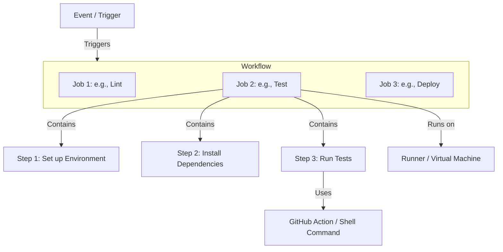

# Continuous Integration (CI) with GitHub Actions

Continuous Integration (CI) is a software development practice where developers regularly merge their code changes into a central repository, after which automated builds and tests are run. GitHub Actions is a powerful, flexible platform that allows you to automate your software development workflows directly within your GitHub repository.

---

## 1. Understanding Workflow Automation

Workflow automation in GitHub Actions allows you to automate tasks in your software development lifecycle. These automated workflows are event-driven, meaning they execute automatically when specified events occur.

### Key Architectural Components

To understand GitHub Actions, you need to understand its fundamental building blocks:



1. **Workflow**: An automated procedure added to your repository. A workflow is composed of one or more jobs and can be triggered by an event. It is defined in a YAML file in your repository.
2. **Event**: A specific activity in your repository that triggers a workflow run. For example, a push to a branch, a pull request creation, or a new issue being opened.
3. **Job**: A set of steps in a workflow that execute on the same runner. By default, jobs run in parallel, but you can configure dependencies between them so they run sequentially.
4. **Step**: An individual task that runs commands in a job. A step can be either a shell command (a script) or an **Action**. Steps run sequentially on the same runner and share data.
5. **Action**: A standalone application or reusable block of code that performs a complex, frequently repeated task. You can write your own actions or use actions shared by the GitHub community (e.g., checking out code, setting up language environments).
6. **Runner**: A server that runs your workflows when they are triggered. Each runner can run a single job at a time. GitHub provides hosted runners (Ubuntu Linux, Windows, macOS), or you can host your own runners.

---

## 2. Workflow Directory Structure

For GitHub Actions to discover and execute your workflows, they must be stored in a specific directory structure at the root of your repository.

### Standard Location

```text
your-repository/
├── .github/
│   └── workflows/
│       ├── ci-pipeline.yml
│       └── release.yml
├── src/
├── package.json
└── README.md
```

> [!IMPORTANT]
> - All workflow files **must** be stored in the `.github/workflows/` directory.
> - The files must use either the `.yml` or `.yaml` extension.
> - Subdirectories inside `.github/workflows/` are **not** searched; workflows placed in subfolders will not run.

### Typical File Content Layout

A workflow YAML file generally follows this top-level structure:

```yaml
name: CI Pipeline                # The name of the workflow (displayed in GitHub UI)

on: [push, pull_request]        # The event(s) that trigger the workflow

env:                             # Environment variables global to the workflow
  NODE_VERSION: '20'

jobs:                            # The group of jobs to execute
  build-and-test:                # Job ID
    runs-on: ubuntu-latest       # The type of runner machine to run the job on
    
    steps:                       # The sequence of tasks to perform
      - name: Checkout Code      # Step name
        uses: actions/checkout@v4 # Uses a pre-made GitHub Action
        
      - name: Run Script         # Step name
        run: npm run test        # Runs a shell command
```

---

## 3. Events and Triggers

Events are the catalyst for running workflows. GitHub Actions offers a comprehensive set of triggers to integrate automation into every stage of your development cycle.

### Common Trigger Types

| Event Type | Description | Configuration Example |
| :--- | :--- | :--- |
| `push` | Triggered when code is pushed to the repository. | `on: push` |
| `pull_request` | Triggered when a PR is created, updated, or reopened. | `on: pull_request` |
| `workflow_dispatch` | Allows manual triggering of the workflow via the GitHub UI. | `on: workflow_dispatch` |
| `schedule` | Triggers the workflow at scheduled times using POSIX cron syntax. | `on: schedule` |
| `release` | Triggered when a release is created, edited, or published. | `on: release` |

### Fine-Tuning Triggers with Filters

You often want to restrict workflows to run only under specific conditions (e.g., only run deployment on `main`, or only test when code files change).

#### 1. Branch Filtering
Restrict workflow runs to specific branches.

```yaml
on:
  push:
    branches:
      - main
      - 'releases/**'
    branches-ignore:
      - 'experimental/**'
```

#### 2. Path Filtering
Trigger workflows only when specific files are modified. This is extremely useful for monorepos or separating documentation updates from code builds.

```yaml
on:
  push:
    paths:
      - 'src/**'
      - 'package.json'
    paths-ignore:
      - 'docs/**'
      - '**.md'
```

#### 3. Scheduled Cron Triggers
Schedule a workflow to run automatically at specific times.

```yaml
on:
  schedule:
    # Runs at 00:00 every Sunday (UTC)
    - cron: '0 0 * * 0'
```

---

## 4. Complete Hands-on Example: Anatomy of a CI Workflow

Here is a practical, full-scale continuous integration workflow for a Node.js application that checks out code, sets up Node.js, runs linters, and executes automated tests.

```yaml
name: Node.js Continuous Integration

# Trigger this workflow on pushes or pull requests to the main branch
on:
  push:
    branches: [ main ]
  pull_request:
    branches: [ main ]

# Ensure only one running instance of this workflow runs per branch at a time
concurrency:
  group: ${{ github.workflow }}-${{ github.ref }}
  cancel-in-progress: true

jobs:
  # Job 1: Quality Check (Linting & Formatting)
  lint:
    name: Lint & Format Code
    runs-on: ubuntu-latest
    steps:
      - name: Checkout repository code
        uses: actions/checkout@v4

      - name: Set up Node.js environment
        uses: actions/setup-node@v4
        with:
          node-version: '20'
          cache: 'npm' # Automatically caches dependency directory

      - name: Install dependencies
        run: npm ci

      - name: Run code linter
        run: npm run lint

  # Job 2: Build and Test
  # This job depends on 'lint' passing successfully first!
  build-and-test:
    name: Build & Test Application
    runs-on: ubuntu-latest
    needs: lint # Sequential execution
    
    strategy:
      matrix:
        # Run tests on multiple Node.js versions in parallel
        node-version: [18.x, 20.x, 22.x]

    steps:
      - name: Checkout repository code
        uses: actions/checkout@v4

      - name: Set up Node.js ${{ matrix.node-version }}
        uses: actions/setup-node@v4
        with:
          node-version: ${{ matrix.node-version }}
          cache: 'npm'

      - name: Install dependencies
        run: npm ci

      - name: Build application
        run: npm run build --if-present

      - name: Run test suite
        run: npm run test
```

### Deconstructing the Example:
- **`concurrency`**: Prevents redundant builds by cancelling in-progress runs on the same branch when a new commit is pushed.
- **`needs: lint`**: Tells GitHub Actions not to run `build-and-test` unless the `lint` job finishes successfully. This saves computing credits and time.
- **`strategy.matrix`**: Defines a matrix of different configurations. Here, it creates three separate parallel tasks running on Node.js 18, 20, and 22 respectively.
- **`uses: actions/setup-node@v4` with `cache: 'npm'`**: Speeds up build times dramatically by caching the standard npm package cache directory so dependencies don't need to be fully fetched on every run.
