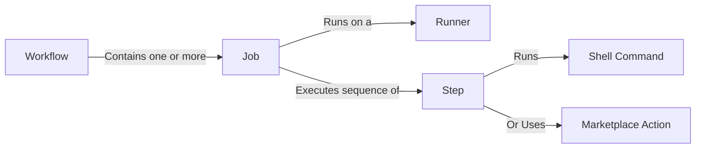

# Deep Dive: GitHub Actions Components and Strategies

This document provides a detailed reference on GitHub Actions components, triggers, matrix strategies, shell commands, and utilizing community and language-specific actions.

---

## 1. Key Components Deep Dive

GitHub Actions is built on a hierarchy of components that work together to execute your automation pipelines.



### Workflows
A workflow is an configurable automated process that you add to your repository.
- **Scope**: Defined by a single YAML file in the `.github/workflows/` directory.
- **Responsibility**: Coordinates the entire automation sequence, defining when it should run (triggers) and what it should execute (jobs).

### Jobs
A job is a set of steps that execute on the same runner virtual machine.
- **Execution**: By default, jobs run in parallel to maximize throughput. You can enforce sequential execution using the `needs` keyword.
- **Shared State**: Steps within a single job share the same filesystem, allowing you to build assets in one step and run them in a subsequent step.

### Steps
A step is an individual task within a job.
- **Sequence**: Steps run sequentially, one after another, in the order they are defined.
- **Types**: A step can either run a command-line script (`run`) or call a reusable action (`uses`).

### Actions
An action is a standalone, reusable unit of task automation.
- **Purpose**: Minimizes repetitive code across workflows.
- **Source**: You can write your own actions (Docker-based, JavaScript-based, or composite shell scripts) or use public actions from the GitHub Marketplace.

### Runners
A runner is a virtual machine or container hosted by GitHub (or hosted by you) that executes the jobs defined in a workflow.
- **GitHub-hosted Runners**: Fast, clean environments (Ubuntu, Windows, macOS) provided with popular software and CLI tools pre-installed.
- **Self-hosted Runners**: Custom hardware or VMs you manage, useful when you need custom dependencies, local network access, or specialized computing hardware.

---

## 2. Workflow Triggers: Getting Specific

Triggers determine exactly when a workflow starts. You can configure multiple triggers for a single workflow.

### Push (`push`)
Triggers when a commit or tag is pushed to the repository.
```yaml
on:
  push:
    branches:
      - main
      - 'feature/*'      # Matches feature/login, but not feature/login/oauth
      - 'release/**'     # Matches nested branches like release/2026/v1.0
    tags:
      - 'v*'             # Matches semantic versions like v1.0.0
```

### Pull Request (`pull_request`)
Triggers on pull request activity. You can scope it to target branches and specific pull request action types.
```yaml
on:
  pull_request:
    types: [opened, synchronize, reopened] # Runs on initial creation, new commits, or reopening
    branches:
      - main
```

### Schedule (`schedule`)
Triggers a workflow automatically at scheduled UTC times using standard POSIX cron syntax.
```yaml
on:
  schedule:
    # Format: minute hour day-of-month month day-of-week
    # Runs at 15:30 (3:30 PM UTC) every Tuesday and Thursday
    - cron: '30 15 * * 2,4'
```

### Manual Workflow (`workflow_dispatch`)
Allows developers to trigger the workflow manually from the GitHub actions tab or via the GitHub API. You can define custom inputs that the user provides before running.
```yaml
on:
  workflow_dispatch:
    inputs:
      environment:
        description: 'Target Environment'
        required: true
        default: 'staging'
        type: choice
        options:
          - staging
          - production
      debug_mode:
        description: 'Enable Debug Logging'
        required: false
        default: false
        type: boolean
```

---

## 3. Jobs & Matrix Strategies

Matrix strategies allow you to easily test your code across multiple operating systems, language versions, and dependency sets simultaneously without repeating your job configuration.

### Basic Matrix Configuration
This creates 6 concurrent jobs testing 3 Node.js versions on 2 operating systems:

```yaml
jobs:
  test:
    runs-on: ${{ matrix.os }}
    strategy:
      matrix:
        os: [ubuntu-latest, windows-latest]
        node-version: [18, 20, 22]
    
    steps:
      - uses: actions/checkout@v4
      - uses: actions/setup-node@v4
        with:
          node-version: ${{ matrix.node-version }}
```

### Advanced Matrix: Including and Excluding Options
You can fine-tune your matrix using `include` to add specific combinations, or `exclude` to remove specific illegal or unnecessary combinations.

```yaml
strategy:
  matrix:
    os: [ubuntu-latest, windows-latest, macos-latest]
    python-version: ['3.10', '3.11', '3.12']
    exclude:
      # Do not run older Python version on macOS to save runners
      - os: macos-latest
        python-version: '3.10'
    include:
      # Add an experimental job configuration with an unreleased Python version
      - os: ubuntu-latest
        python-version: '3.13-dev'
        experimental: true
```

---

## 4. Steps & Shell Commands

The `run` keyword allows you to execute shell scripts on the runner.

### Multi-line Commands
Use the YAML literal block scalar block indicator `|` to run complex scripts:

```yaml
steps:
  - name: Build and Package
    run: |
      echo "Starting compile step..."
      npm run build
      tar -czf release-assets.tar.gz ./dist
      echo "Packaging complete!"
```

### Customizing the Shell
By default, GitHub Actions uses a shell suited for the runner OS (Bash on Linux/macOS, PowerShell on Windows). You can explicitly declare the shell:

```yaml
steps:
  - name: Run Python script inline
    shell: python
    run: |
      import os
      print("Python running inside runner. OS:", os.name)

  - name: Run PowerShell script on Linux
    shell: pwsh
    run: Get-Location
```

### Working Directory
You can set a specific working directory for a single step, or for all steps in a job:

```yaml
jobs:
  build:
    runs-on: ubuntu-latest
    defaults:
      run:
        working-directory: ./frontend # All run steps in this job default to this directory
    steps:
      - uses: actions/checkout@v4
      - run: npm install              # Runs inside ./frontend
```

---

## 5. Using Marketplace Actions

The GitHub Marketplace contains thousands of pre-built actions you can incorporate into your pipeline.

### Referencing Actions
Actions are referenced using the `uses` tag with the syntax: `owner/repository@version`.

> [!WARNING]
> Always pin your actions to a specific version to ensure your build is deterministic and safe from breaking upstream changes.

```yaml
steps:
  # Pinning to a major version (Recommended for most cases - receives minor/patch updates)
  - uses: actions/checkout@v4

  # Pinning to a specific semantic release tag
  - uses: actions/checkout@v4.1.7

  # Pinning to a specific git commit SHA (Most secure; prevents malicious code replacement)
  - uses: actions/checkout@692973e3d937129bcbf40652eb9f2f61becf3332
```

### Passing Parameters with `with`
Many actions accept input parameters via the `with` dictionary:

```yaml
- name: Upload Build Artifacts
  uses: actions/upload-artifact@v4
  with:
    name: distribution-build
    path: dist/
    retention-days: 5
```

---

## 6. Language-Specific Actions & Caching

GitHub and the community provide specialized actions to bootstrap language runtimes, manage dependencies, and speed up builds via caching.

### Node.js
```yaml
- uses: actions/setup-node@v4
  with:
    node-version: '20.x'
    cache: 'npm' # Supports 'npm', 'yarn', or 'pnpm'
```

### Python
```yaml
- uses: actions/setup-python@v5
  with:
    python-version: '3.11'
    cache: 'pip' # Speeds up installations by caching requirements.txt packages
```

### Java
```yaml
- uses: actions/setup-java@v4
  with:
    distribution: 'temurin' # Options: zulu, temurin, corretto, microsoft, etc.
    java-version: '17'
    cache: 'maven'         # Supports 'maven' or 'gradle'
```

### Go
```yaml
- uses: actions/setup-go@v5
  with:
    go-version: '1.21'
    cache: true # Enabled by default in setup-go@v5 to cache Go modules
```

---

## 7. Best Practices Summary

1. **Leverage Matrix Strategies**: Minimize redundant job definitions by using matrices when running multi-version testing.
2. **Utilize Dependency Caching**: Always specify the `cache` parameter on setup actions (Node, Python, Java, etc.) to significantly reduce execution times.
3. **Use Descriptive Step Names**: Always add `name:` to steps to make logs readable and easy to debug when runs fail.
4. **Secure Your Inputs**: Use `concurrency` to cancel redundant workflows and secure custom `workflow_dispatch` inputs from command injection attacks by passing them as environment variables instead of direct shell string interpolation.
