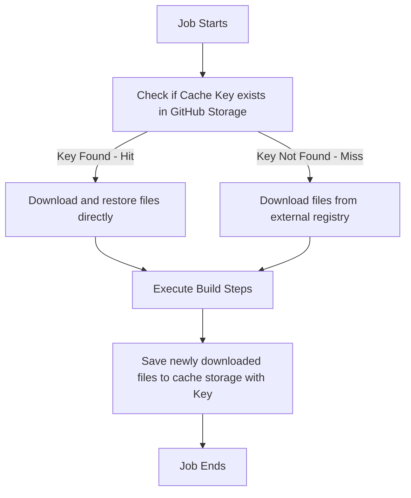

# GitHub Actions: Caching, Multi-Job Workflows, Deployments, and Runners

This document explores advanced CI/CD techniques in GitHub Actions: caching mechanics, multi-job workflow coordination, cloud deployment strategies, runner architectures (GitHub-hosted vs. self-hosted), and runners' security hardening.

---

## 1. Caching for Faster Builds

In standard workflows, runners pull fresh dependencies from package managers (npm, pip, maven) on every single run. Caching permits storing these files after an initial download, accelerating subsequent build executions.

### How Caching Works under the Hood

GitHub Actions provides the general-purpose `actions/cache@v4` action to store and retrieve files. It operates on a **Cache Key** system:



### Implementing `actions/cache` in YAML

Here is how you write a general caching block for packages:

```yaml
- name: Cache Node modules
  uses: actions/cache@v4
  with:
    path: ~/.npm # The directory or files you want to cache
    key: ${{ runner.os }}-node-${{ hashFiles('**/package-lock.json') }}
    restore-keys: |
      ${{ runner.os }}-node-
```

### Key Parameter Breakdown:
- **`path`**: The file path on the runner to back up and restore.
- **`key`**: The unique identifier for this cache. We generate this using:
  - `runner.os`: The OS type (e.g., Ubuntu, macOS), ensuring Windows binaries aren't mixed into Linux environments.
  - `hashFiles('**/package-lock.json')`: Calculates a SHA256 hash of your lockfile. If dependencies change, the lockfile changes, creating a new cache key.
- **`restore-keys`**: A fallback list of partial keys to check if an exact key match isn't found. This restores the most recent similar cache, reducing the amount of updates required.

---

## 2. Multi-Job Workflows & Data Sharing

Complex workflows often require dividing work into multiple distinct jobs (e.g., testing, building, linting, deploying) that execute sequentially or in parallel.

### Enforcing Sequence with `needs`

By default, jobs run in parallel. Use `needs` to enforce dependency graphs.

```yaml
jobs:
  lint:
    runs-on: ubuntu-latest
    # ...
  
  test:
    runs-on: ubuntu-latest
    # ...

  build:
    runs-on: ubuntu-latest
    needs: [lint, test] # build runs only after lint and test succeed
    # ...

  deploy:
    runs-on: ubuntu-latest
    needs: build # deploy runs only after build succeeds
```

### Sharing Data Between Jobs using Artifacts

Because each job runs on an entirely separate runner machine (with a clean filesystem), **files do not persist between jobs**. To share data (e.g., passing a compiled React build from the `build` job to the `deploy` job), you must upload it to GitHub's artifact storage.

```yaml
jobs:
  build:
    runs-on: ubuntu-latest
    steps:
      - uses: actions/checkout@v4
      - name: Build Assets
        run: npm run build
      - name: Upload Build Output
        uses: actions/upload-artifact@v4
        with:
          name: production-assets
          path: dist/ # Folder containing index.html, JS, CSS bundles
          retention-days: 1 # Temp upload

  deploy:
    runs-on: ubuntu-latest
    needs: build
    steps:
      - name: Download Build Output
        uses: actions/download-artifact@v4
        with:
          name: production-assets
          path: public/ # Extracts assets directly here
      - name: Publish to Hosting Server
        run: echo "Deploying assets from public/..."
```

---

## 3. Deploying to Cloud and Production Servers

Deploying securely from GitHub Actions requires passing credentials to cloud providers without exposing secrets or hardcoding passwords.

### Cloud Deployment using OpenID Connect (OIDC)

> [!TIP]
> **Best Practice**: Avoid long-lived cloud credentials (like AWS IAM Access Keys) inside GitHub Secrets. Instead, use **OpenID Connect (OIDC)** to request temporary, short-lived tokens directly from your cloud provider (AWS, GCP, Azure).

```yaml
jobs:
  deploy:
    runs-on: ubuntu-latest
    # Required permissions to request OIDC token
    permissions:
      id-token: write
      contents: read
    steps:
      - name: Checkout Code
        uses: actions/checkout@v4

      - name: Configure AWS Credentials via OIDC
        uses: aws-actions/configure-aws-credentials@v4
        with:
          role-to-assume: arn:aws:iam::123456789012:role/GitHubActionsWorkflowRole
          aws-region: us-east-1

      - name: Deploy to Amazon S3
        run: aws s3 sync dist/ s3://my-production-bucket/ --delete
```

### Deploying to a Virtual Private Server (VPS) via SSH

For traditional VMs (DigitalOcean, AWS EC2, Linode), you can securely execute commands and transfer files over SSH:

```yaml
- name: SSH and Deploy to Server
  uses: appleboy/ssh-action@v1.0.3
  with:
    host: ${{ secrets.SERVER_IP }}
    username: ${{ secrets.SERVER_USER }}
    key: ${{ secrets.SSH_PRIVATE_KEY }}
    port: 22
    script: |
      cd /var/www/my-app
      git pull origin main
      npm install --production
      pm2 restart server-process
```

---

## 4. Runner Architectures Deep Dive

Runners are the processing engines behind GitHub Actions. You can choose between environments hosted entirely by GitHub, or host your own machine network.

| Feature | GitHub-hosted Runners | Self-hosted Runners |
| :--- | :--- | :--- |
| **Maintenance** | None (Fully managed by GitHub) | High (You manage updates, OS, and safety) |
| **Pricing** | Included in free tier / Paid per-minute | Free (You pay for the physical hardware/VM) |
| **OS Options** | Ubuntu, Windows Server, macOS | Any (Linux, Windows, macOS, ARM, Docker) |
| **Execution Env** | Clean VM spawned for every job | Shared or ephemeral environment |
| **Custom Hardware**| Standard sizes (Larger VMs available) | Highly flexible (GPUs, custom RAM/CPU cores) |
| **Network Access** | Public IPs (Requires whitelisting) | Internal/Private VPC networks |

### GitHub-hosted Runners
Perfect for standard build sequences, open source repositories, and teams wanting zero administrative overhead.
- **Hardware Profile (Standard Linux)**: 2 vCPUs, 7 GB RAM, 14 GB SSD.
- **Security**: The VM is completely destroyed after your job completes, preventing files or state from leaking to subsequent builds.

### Self-hosted Runners
Best for teams requiring access to local internal databases, fast local cache layers, GPU-accelerated computing, or long-running jobs (beyond GitHub's 6-hour limit).

#### Initial Setup of a Self-Hosted Runner on Linux:
1. Create the runner folder on your machine:
   ```bash
   mkdir actions-runner && cd actions-runner
   ```
2. Download and unpack the runner package:
   ```bash
   curl -o actions-runner-linux-x64.tar.gz -L https://github.com/actions/runner/releases/download/v2.311.0/actions-runner-linux-x64.tar.gz
   tar xzf ./actions-runner-linux-x64.tar.gz
   ```
3. Configure the runner (connect it to your repo using a token):
   ```bash
   ./config.sh --url https://github.com/owner/repo --token YOUR_REGISTRATION_TOKEN
   ```
4. Run the runner:
   ```bash
   ./run.sh
   ```

---

## 5. Self-Hosted Runner Security & Management

While powerful, self-hosted runners introduce specific security vulnerabilities if mismanaged.

> [!CAUTION]
> **Major Security Risk**: Never use self-hosted runners on **Public Repositories**. Malicious users can submit Pull Requests containing arbitrary code inside their workflow files, executing dangerous commands directly on your private server infrastructure.

### Hardening and Management Strategies

1. **Limit Runner Scoping**: Register self-hosted runners at the Organization or Repository level rather than globally to restrict what repos can access your server.
2. **Ephemeral Runners**: Configure your self-hosted runners with the `--ephemeral` flag during configuration.
   ```bash
   ./config.sh --url https://github.com/owner/repo --token TOKEN --ephemeral
   ```
   *Why?* The runner automatically unregisters and cleans up its environment after running exactly **one** job. A fresh container/VM container must be spun up for the next job, preventing persistent malware.
3. **Use Non-Root Users**: Never run the `./run.sh` script or service as the administrator/root user. Create a low-privileged system user account specifically for executing builds.
4. **Environment Isolation**: Execute self-hosted runners inside isolated virtual environments (like Docker containers or isolated Kubernetes pods) rather than bare metal instances to contain any malicious processes.
5. **Enforce Repository Environment Approvals**: Use GitHub Environments to mandate manual approvals from trusted maintainers before executing deployment code or decrypting secrets on your runner machines.
