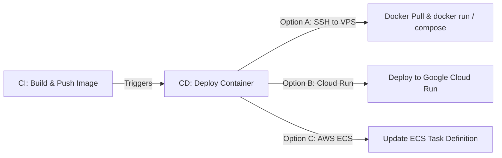

# Continuous Integration & Deployment (CI/CD) with Docker and GitHub Actions

Integrating Docker with GitHub Actions enables you to build containerized applications, test them inside standard environments, and deploy immutable images directly to registries like Docker Hub or GitHub Container Registry (GHCR).

---

## 1. Building Docker Images in CI

Building a Docker image inside a GitHub Actions runner is straightforward, but doing it **efficiently** requires setting up a proper builder and caching layers.

### Key Tools Needed
1. **QEMU**: Allows you to build images for multiple hardware platforms (e.g., ARM64, AMD64).
2. **Buildx**: Enriches the Docker build command with advanced caching, multi-platform builds, and concurrent executions.

### Basic Workflow to Build a Docker Image:

```yaml
name: Build Docker Image

on:
  push:
    branches: [ main ]

jobs:
  build-only:
    runs-on: ubuntu-latest
    steps:
      - name: Checkout repository code
        uses: actions/checkout@v4

      - name: Set up QEMU
        uses: docker/setup-qemu-action@v3

      - name: Set up Docker Buildx
        uses: docker/setup-buildx-action@v3

      - name: Build Docker Image (Local only)
        uses: docker/build-push-action@v6
        with:
          context: .
          file: ./Dockerfile
          push: false # Do not push to registry yet
          tags: my-app:latest
```

---

## 2. Pushing to Docker Hub

To push your built image to Docker Hub, you must authenticate securely using credentials stored in your repository secrets.

### 1. Store Credentials in Secrets
Go to your repository settings -> **Secrets and variables** -> **Actions** and create two repository secrets:
- `DOCKER_USERNAME`: Your Docker Hub username.
- `DOCKER_PASSWORD`: Your Docker Hub Access Token (recommended instead of your main password).

### 2. The Build & Push Workflow

```yaml
name: Push to Docker Hub

on:
  push:
    tags:
      - 'v*' # Trigger only when semantic tags are pushed (e.g., v1.0.0)

jobs:
  docker-hub-publish:
    runs-on: ubuntu-latest
    steps:
      - name: Checkout Code
        uses: actions/checkout@v4

      - name: Set up QEMU
        uses: docker/setup-qemu-action@v3

      - name: Set up Docker Buildx
        uses: docker/setup-buildx-action@v3

      - name: Log in to Docker Hub
        uses: docker/login-action@v3
        with:
          username: ${{ secrets.DOCKER_USERNAME }}
          password: ${{ secrets.DOCKER_PASSWORD }}

      - name: Extract metadata for Docker
        id: meta
        uses: docker/metadata-action@v5
        with:
          images: ${{ secrets.DOCKER_USERNAME }}/my-node-app

      - name: Build and Push to Docker Hub
        uses: docker/build-push-action@v6
        with:
          context: .
          push: true
          tags: ${{ steps.meta.outputs.tags }}
          labels: ${{ steps.meta.outputs.labels }}
          # Docker Layer Caching (Speeds up subsequent builds!)
          cache-from: type=gha
          cache-to: type=gha,mode=max
```

> [!TIP]
> **Docker Layer Caching (`gha` type)**: Utilizing `cache-from: type=gha` and `cache-to: type=gha` allows Buildx to store intermediary build layers inside GitHub Action's native cache network. When a line in your Dockerfile changes, only subsequent layers are built from scratch.

---

## 3. Pushing to GitHub Container Registry (GHCR)

GitHub Container Registry (GHCR) is hosted within GitHub and integrates directly with your repository permissions.

### Why use GHCR?
- **Zero Credentials Management**: You don't need to manually configure repository secrets. GitHub automatically provisions a temporary cryptographic credential called `${{ secrets.GITHUB_TOKEN }}` valid for the duration of the job.
- **Fast Access**: Since it is hosted on GitHub infrastructure, pushing and pulling images inside your workflows is incredibly fast.

### GHCR Publishing Workflow:

```yaml
name: Push to GHCR

on:
  push:
    branches: [ main ]

env:
  REGISTRY: ghcr.io
  IMAGE_NAME: ${{ github.repository }} # e.g., owner/repo-name

jobs:
  ghcr-publish:
    runs-on: ubuntu-latest
    permissions:
      contents: read
      packages: write # Crucial permission required to publish to GHCR

    steps:
      - name: Checkout Code
        uses: actions/checkout@v4

      - name: Set up Docker Buildx
        uses: docker/setup-buildx-action@v3

      - name: Log in to GHCR
        uses: docker/login-action@v3
        with:
          registry: ${{ env.REGISTRY }}
          username: ${{ github.actor }} # The user account running the workflow
          password: ${{ secrets.GITHUB_TOKEN }} # Provided automatically by GitHub

      - name: Extract Docker metadata
        id: meta
        uses: docker/metadata-action@v5
        with:
          images: ${{ env.REGISTRY }}/${{ env.IMAGE_NAME }}
          tags: |
            type=ref,event=branch
            type=semver,pattern={{version}}
            type=sha,format=short

      - name: Build and Push to GHCR
        uses: docker/build-push-action@v6
        with:
          context: .
          push: true
          tags: ${{ steps.meta.outputs.tags }}
          labels: ${{ steps.meta.outputs.labels }}
          cache-from: type=gha
          cache-to: type=gha,mode=max
```

---

## 4. Deploying Containerized Applications to Servers and Clouds

Once your Docker image is successfully built and pushed to a registry, you can trigger a deploy sequence to deploy the container to servers or clouds.



### Option A: Deploy to a VPS via SSH (Pull & Run)
In this strategy, GitHub Actions SSHs into your remote server, logs into your container registry, pulls down the newly built image, stops the old container, and spins up the new one.

```yaml
  deploy-vps:
    runs-on: ubuntu-latest
    needs: ghcr-publish # Run only after push finishes
    steps:
      - name: Executing remote SSH commands to deploy
        uses: appleboy/ssh-action@v1.0.3
        with:
          host: ${{ secrets.SERVER_IP }}
          username: ${{ secrets.SERVER_USER }}
          key: ${{ secrets.SSH_PRIVATE_KEY }}
          script: |
            # Log in to GHCR on the private server
            echo "${{ secrets.GITHUB_TOKEN }}" | docker login ghcr.io -u ${{ github.actor }} --password-stdin
            
            # Stop existing container
            docker stop my-app-container || true
            docker rm my-app-container || true
            
            # Pull the latest image
            docker pull ghcr.io/${{ github.repository }}:main
            
            # Spin up the new container with custom settings
            docker run -d \
              --name my-app-container \
              -p 80:3000 \
              --restart always \
              ghcr.io/${{ github.repository }}:main
```

### Option B: Deploy to Google Cloud Run (Serverless Container)
For serverless infrastructure, you can deploy your Docker image directly to Google Cloud Run:

```yaml
  deploy-gcp:
    runs-on: ubuntu-latest
    needs: ghcr-publish
    permissions:
      id-token: write # For OIDC
      contents: read
    steps:
      - name: Authenticate with Google Cloud
        uses: google-github-actions/auth@v2
        with:
          workload_identity_provider: ${{ secrets.GCP_WORKLOAD_IDENTITY_PROVIDER }}
          service_account: ${{ secrets.GCP_SERVICE_ACCOUNT }}

      - name: Deploy to Cloud Run
        uses: google-github-actions/deploy-cloudrun@v2
        with:
          service: my-serverless-service
          image: ghcr.io/${{ github.repository }}:main
          region: us-central1
```

### Option C: Deploy to AWS ECS (Fargate Container)
To deploy containerized apps to AWS ECS:

```yaml
  deploy-aws:
    runs-on: ubuntu-latest
    needs: ghcr-publish
    steps:
      - name: Configure AWS Credentials
        uses: aws-actions/configure-aws-credentials@v4
        with:
          aws-access-key-id: ${{ secrets.AWS_ACCESS_KEY_ID }}
          aws-secret-access-key: ${{ secrets.AWS_SECRET_ACCESS_KEY }}
          aws-region: us-east-1

      - name: Download Active Task Definition
        run: |
          aws ecs describe-task-definition --task-definition my-task-def --query taskDefinition > task-definition.json

      - name: Fill in the new image ID in the Amazon ECS task definition
        id: render-task-def
        uses: aws-actions/amazon-ecs-render-task-definition@v1
        with:
          task-definition: task-definition.json
          container-name: app-container
          image: ghcr.io/${{ github.repository }}:main

      - name: Deploy Amazon ECS task definition
        uses: aws-actions/amazon-ecs-deploy-task-definition@v2
        with:
          task-definition: ${{ steps.render-task-def.outputs.task-definition }}
          service: my-ecs-service
          cluster: my-ecs-cluster
          wait-for-service-stability: true
```
