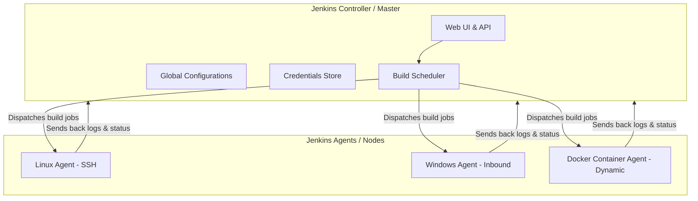

# Jenkins Foundations: Architecture, Installation, Plugins & Security

Jenkins is an open-source automation server that enables developers to build, test, and deploy their software. It is one of the most widely used tools for Continuous Integration (CI) and Continuous Delivery (CD) due to its extensive plugin ecosystem, active community, and flexibility.

---

## 1. Jenkins Architecture (Master/Agent Model)

Jenkins uses a distributed architecture based on a **Master/Agent** (now more commonly referred to as **Controller/Agent**) model to handle workloads. Instead of executing all jobs on a single server, Jenkins delegates workloads to multiple nodes.

### Controller (Master)
The Controller is the central nervous system of Jenkins. It hosts the user interface, configuration settings, and orchestration engine.
- **Key Responsibilities**:
  - Serving the web dashboard (UI) and API.
  - Hosting system configurations and build job definitions.
  - Scheduling build jobs and putting them in the build queue.
  - Dispatching builds to agents for actual execution.
  - Monitoring agent health and connection states.
  - Storing build logs, history, and test reports.
  - Managing user credentials and security policies.

### Agents (Slaves)
An Agent is a separate machine or container that runs a lightweight client program (`agent.jar`) and executes the build tasks dispatched by the Controller.
- **Key Responsibilities**:
  - Listening for instructions from the Controller.
  - Pulling source code from repositories (Git, SVN, etc.).
  - Executing build scripts, compile steps, unit tests, and packaging commands.
  - Sending build outputs, logs, and execution statuses back to the Controller.
- **Types of Agents**:
  - **SSH Agents**: The Controller initiates a connection to the Agent over SSH.
  - **Inbound/JNLP Agents**: The Agent initiates a connection to the Controller (often used when the Agent is behind a firewall or NAT).
  - **Ephemeral/Container-based Agents**: Spun up dynamically in Kubernetes or Docker for a specific build and destroyed immediately after completion.

### Architecture Workflow Diagram



### Why use a Distributed Architecture?
1. **Load Balancing / Scalability**: Prevents the Controller from running out of CPU and memory. Heavy compilation and testing workloads are offloaded to agents.
2. **Environment Isolation**: Different agents can be configured with different operating systems (e.g., Linux, Windows, macOS) and toolsets (e.g., specific Java, Python, or Go versions) to test cross-platform compatibility.
3. **Security**: Keeps the Controller secure. If a malicious script runs during a build, it only compromises the isolated Agent, not the master configuration database on the Controller.

---

## 2. Installation & UI Overview

### Installation Methods
Jenkins runs on the Java Runtime Environment (JRE). The main deployment options are:

1. **Docker Container (Recommended)**
   Running Jenkins in Docker is simple and isolates it from host OS dependencies.
   ```bash
   docker run -d \
     -p 8080:8080 -p 50000:50000 \
     --name jenkins-server \
     -v jenkins_home:/var/jenkins_home \
     jenkins/jenkins:lts
   ```
   *Note: Port `8080` is for the Web UI, and `50000` is for inbound agent connections.*

2. **Native Package Installation (Debian/Ubuntu)**
   Requires Java (OpenJDK 11 or 17).
   ```bash
   # Add Jenkins Debian repository key
   sudo wget -O /usr/share/keyrings/jenkins-keyring.asc \
     https://pkg.jenkins.io/debian-stable/jenkins.io-2023.key
   
   # Add package source list
   echo "deb [signed-by=/usr/share/keyrings/jenkins-keyring.asc] \
     https://pkg.jenkins.io/debian-stable binary/" | sudo tee \
     /etc/apt/sources.list.d/jenkins.list > /dev/null
   
   # Update and install
   sudo apt-get update
   sudo apt-get install openjdk-17-jre -y
   sudo apt-get install jenkins -y
   ```

3. **Standalone Java Executable (WAR File)**
   ```bash
   java -jar jenkins.war --httpPort=8080
   ```

### Initial Setup & Unlock
When first booting Jenkins, it is locked for security:
1. **Retrieve Admin Password**: The UI prompts for an administrator password. Find it on the server filesystem:
   - Docker: `docker exec jenkins-server cat /var/jenkins_home/secrets/initialAdminPassword`
   - Linux: `sudo cat /var/lib/jenkins/secrets/initialAdminPassword`
2. **Install Plugins**: The setup wizard asks to install "Suggested Plugins" (recommended for beginners) or select specific ones.
3. **Create Admin User**: Define the username, password, and contact details for the primary administrator account.
4. **Instance Configuration**: Confirm the URL that users and agents will use to connect.

### UI Overview
Once logged in, you see the Jenkins Dashboard:
- **Left Navigation Sidebar**:
  - **New Item**: Create a new build job (Freestyle, Pipeline, Multi-branch, etc.).
  - **People**: Lists registered users and their details.
  - **Build History**: Chronological list of all runs.
  - **Manage Jenkins**: The control center for configuring nodes, plugins, security, and tools.
  - **My Views**: Custom filters and views for organized job presentation.
- **Main Panel (Dashboard)**: Shows a table of jobs, their current status (represented by weather icons reflecting build stability), last success/failure time, and duration.
- **Build Executor Status (Bottom Left)**: Displays the active build execution threads on the local machine and connected agents.
- **Build Queue (Bottom Left)**: Shows jobs waiting to run because no executor is free.

---

## 3. Plugins Management

Plugins are modular add-ons that extend Jenkins' core capabilities. Jenkins has over 1,800 community-contributed plugins supporting integrations with Git, Maven, Docker, Kubernetes, Ansible, Slack, SonarQube, AWS, and more.

### Plugin Manager
Accessible via **Manage Jenkins** -> **Plugins**:
*   **Updates**: Displays updates for installed plugins.
*   **Available Plugins**: Searchable index of all online plugins available for installation.
*   **Installed Plugins**: Lists active and inactive installed plugins. Allows enabling, disabling, or uninstalling.
*   **Advanced Settings**: Used to configure a proxy server, change the update site URL, or manually upload a `.hpi` / `.jpi` plugin file.

### Installation Process
1. Search for a plugin in the **Available Plugins** tab.
2. Select the checkbox and click **Install without restart** or **Download now and install after restart**.
3. Jenkins automatically downloads the plugin along with any dependencies it requires.

### Best Practices for Plugins
- **Keep it Minimal**: Only install plugins you actively need. Too many plugins slow down Jenkins, consume memory, and increase security vulnerabilities.
- **Regular Updates**: Apply security updates promptly. Check plugin changelogs before upgrading.
- **Pre-Update Backups**: Back up the `$JENKINS_HOME` directory (specifically `$JENKINS_HOME/plugins` and configurations) before upgrading core plugins, as incompatibilities can break pipelines.

---

## 4. Security, Users, and Roles

Jenkins contains a robust security framework to control who can access the server and what actions they can perform.

### 1. Security Realm (Authentication)
Authentication determines **who** is logging in. Configured in **Manage Jenkins** -> **Security**:
- **Jenkins' own user database**: Jenkins stores credentials locally in its home directory. Best for small teams or local testing.
- **LDAP**: Connects to an enterprise Active Directory or LDAP server to authenticate users.
- **Single Sign-On (SAML / OAuth)**: Plugins allow authentication using third-party providers like GitHub, GitLab, Google, or Keycloak.

### 2. Authorization Strategy (Authorization)
Authorization determines **what** an authenticated user can do.
- **Anyone can do anything**: No security restriction. Suitable for sandboxed local environments.
- **Legacy Mode**: Users are divided into "Admin" (full control) and "Anonymous" (read-only).
- **Logged-in users can do anything**: Once authenticated, users get full access.
- **Matrix-based Security**: Provides a grid mapping users/groups to specific, granular permissions (e.g., Overall Read, Job Build, Job Configure, Credentials View).
- **Role-Based Access Control (RBAC)**: Implemented using the **Role-based Authorization Strategy** plugin. It separates authorization into three types of roles:
  1. **Global Roles**: Broad permissions across the whole instance (e.g., `admin`, `read-only`).
  2. **Item (Project) Roles**: Permissions restricted to specific jobs based on regular expressions (e.g., a role `dev-pipeline` might match regex `dev-.*` allowing developers to trigger and configure only dev pipelines).
  3. **Node Roles**: Controls permissions on specific build agents (e.g., who can configure or take agents online/offline).

### 3. Credentials Store
Jenkins has a built-in credentials provider that stores secrets securely.
- **Types of Credentials**:
  - Username and Password.
  - Secret Text (API Tokens, secret keys).
  - Secret File (configuration files, certificates).
  - SSH Username with Private Key.
  - Vault / AWS Secrets Manager integrations.
- **Scopes**:
  - **Global**: Credentials are accessible across the entire system.
  - **System**: Only accessible to the Jenkins system operations (e.g., agent connections) but not build pipelines.

---

## Relevant Jenkins Commands

*   **Start Jenkins Service (Linux native)**:
    ```bash
    sudo systemctl start jenkins
    ```
*   **Stop Jenkins Service**:
    ```bash
    sudo systemctl stop jenkins
    ```
*   **Restart Jenkins Service**:
    ```bash
    sudo systemctl restart jenkins
    ```
*   **Check Jenkins Status**:
    ```bash
    sudo systemctl status jenkins
    ```
*   **Locate Initial Admin Password**:
    ```bash
    sudo cat /var/lib/jenkins/secrets/initialAdminPassword
    ```
