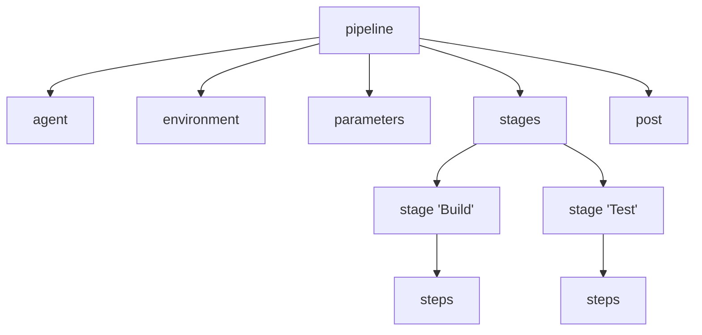

# Jenkins Pipelines: Freestyle vs. Pipeline, Syntax & Structures

Jenkins Pipelines allow you to define your entire build process as code (Pipeline as Code). This document covers the fundamental concepts of Jenkins Pipelines, comparing job types, exploring syntax variants, and detailing the structure of a Jenkinsfile.

---

## 1. Freestyle vs. Pipeline Jobs

In Jenkins, there are two primary ways to define and run a build job: **Freestyle** and **Pipeline**.

| Feature | Freestyle Jobs | Pipeline Jobs |
| :--- | :--- | :--- |
| **Configuration Method** | Configured entirely using the interactive Web UI. | Configured via code written in a `Jenkinsfile` (Pipeline as Code). |
| **Version Control** | Hard to track changes. Job configurations are stored in XML on the server. | Easily version-controlled. The `Jenkinsfile` resides in the repository with application code. |
| **Complex Workflows** | Primarily sequential. Complex logic (loops, parallel steps, conditional branching) is difficult to implement. | Highly flexible. Supports complex branching, loops, error recovery, and parallel stage execution. |
| **Resilience & Durability** | If the Jenkins controller restarts, running Freestyle jobs fail and must start over. | Pipelines are durable. The execution state is checkpointed, allowing pipelines to resume after controller restarts. |
| **User Experience** | Traditional Jenkins UI. | Visualized cleanly using modern UI enhancements like **Blue Ocean** or stage-view grids. |

### Summary
*   **Freestyle jobs** are suitable for simple, straightforward tasks (e.g., triggering a single shell script).
*   **Pipeline jobs** are the industry standard for modern DevOps. They treat the CI/CD pipeline as software, allowing code reviews, pull requests, and multi-branch execution.

---

## 2. Declarative vs. Scripted Pipeline Syntax

Jenkins Pipelines can be written in two syntaxes: **Declarative** and **Scripted**. Both are executed on the same underlying execution engine, but their design philosophies differ.

### A. Declarative Pipeline (Recommended)
Declarative pipelines provide a strict, pre-defined structure to make writing and maintaining pipelines easier and more readable. It uses a structured schema that helps catch syntax errors during configuration loading.

*   **Wrapper**: Enclosed within a `pipeline { ... }` block.
*   **Design**: Opinionated and structured (uses specific directives like `agent`, `stages`, `stage`, `steps`).
*   **Error Checking**: Catches syntax errors before execution begins.

#### Declarative Example:
```groovy
pipeline {
    agent any
    
    stages {
        stage('Checkout') {
            steps {
                git 'https://github.com/example/my-repo.git'
            }
        }
        stage('Build') {
            steps {
                echo 'Building application...'
                sh 'mvn clean compile'
            }
        }
        stage('Test') {
            steps {
                echo 'Running unit tests...'
                sh 'mvn test'
            }
        }
    }
}
```

### B. Scripted Pipeline
Scripted pipelines represent the original pipeline syntax. They are written in Groovy and offer maximum flexibility but require higher Groovy programming knowledge.

*   **Wrapper**: Enclosed within a `node { ... }` block.
*   **Design**: Imperative style (defines exactly *how* tasks are done using Groovy control flows like `if/else`, `try/catch`, loops).
*   **Error Checking**: Errors are caught at runtime during execution.

#### Scripted Example:
```groovy
node {
    stage('Checkout') {
        git 'https://github.com/example/my-repo.git'
    }
    
    stage('Build') {
        try {
            echo 'Building application...'
            sh 'mvn clean compile'
        } catch (err) {
            echo "Build failed: ${err}"
            throw err
        }
    }
    
    stage('Test') {
        echo 'Running unit tests...'
        sh 'mvn test'
    }
}
```

---

## 3. Jenkinsfile Structure (Declarative)

A standard Declarative `Jenkinsfile` consists of specific blocks and directives.



### Core Directives:

1.  **`pipeline`**: The mandatory root block containing all pipeline definitions.
2.  **`agent`**: Specifies where the pipeline or a specific stage will execute.
    *   `agent any`: Run on any available executor.
    *   `agent none`: Do not allocate a global executor (each stage must define its own agent).
    *   `agent { label 'docker-node' }`: Run on an agent labeled `docker-node`.
    *   `agent { docker { image 'maven:3.8-openjdk-17' } }`: Spin up a Docker container using the specified image to execute the steps.
3.  **`stages`**: Contains one or more `stage` directives representing the CI/CD phases.
4.  **`stage`**: Logical group of steps (e.g., 'Checkout', 'Build', 'Test', 'Deploy').
5.  **`steps`**: The actual operations/commands to execute within a stage (e.g., executing shell scripts, archiving artifacts, etc.).
6.  **`post`**: Defines actions to run at the end of a pipeline or stage depending on the outcome.
    *   `always`: Executes regardless of the completion status.
    *   `success`: Executes only if the current run is successful.
    *   `failure`: Executes only if the run fails (useful for Slack/email notifications).
    *   `unstable`: Runs if tests fail but the build succeeded.

---

## 4. Parameters and Environment Variables

### Environment Variables
Environment variables can be accessed globally or inside specific stages.
*   **Built-in Variables**: Jenkins provides standard variables such as:
    *   `env.BUILD_NUMBER`: The current build number (e.g., "15").
    *   `env.BRANCH_NAME`: The branch being built (available in Multibranch pipelines).
    *   `env.JOB_NAME`: The name of the project.
*   **Custom Variables**: Declared via the `environment` directive.

#### Example:
```groovy
pipeline {
    agent any
    environment {
        APP_NAME = 'MyMicroservice'
        DB_URL   = 'jdbc:mysql://localhost:3306/mydb'
    }
    stages {
        stage('Build') {
            steps {
                echo "Building ${env.APP_NAME} - Run #${env.BUILD_NUMBER}"
                sh "echo Connecting to ${DB_URL}"
            }
        }
    }
}
```

### Parameters
Parameters allow pipelines to accept user inputs prior to execution, making them dynamic.

*   **`string`**: Text input.
*   **`choice`**: Dropdown menu.
*   **`booleanParam`**: Checkbox.
*   **`password`**: Secure masked input.

#### Example:
```groovy
pipeline {
    agent any
    parameters {
        string(name: 'DEPLOY_ENV', defaultValue: 'staging', description: 'Target environment')
        choice(name: 'BUILD_TYPE', choices: ['Release', 'Debug'], description: 'Type of build')
        booleanParam(name: 'RUN_TESTS', defaultValue: true, description: 'Check to run tests')
    }
    stages {
        stage('Deploy') {
            steps {
                echo "Deploying to: ${params.DEPLOY_ENV}"
                echo "Build Type: ${params.BUILD_TYPE}"
                
                script {
                    if (params.RUN_TESTS) {
                        echo "Running verification steps..."
                    }
                }
            }
        }
    }
}
```

---

## 5. Jenkins Multi-branch Pipelines

In a team working with feature branches (Git Flow), creating jobs manually for each branch is inefficient. A **Multi-branch Pipeline** automates this process:

1.  **Repository Scan**: You point Jenkins to a source code repository (e.g., GitHub, GitLab).
2.  **Detection**: Jenkins scans all branches in the repository looking for a file named `Jenkinsfile`.
3.  **Automatic Job Creation**: For every branch containing a `Jenkinsfile`, Jenkins automatically creates a dedicated sub-pipeline.
4.  **Automatic Cleanup**: When a feature branch is merged and deleted from the repository, Jenkins automatically archives or deletes its associated pipeline.
5.  **Pull Request (PR) Integration**: It can trigger builds automatically when pull requests are created or updated, facilitating pre-merge testing.

---

## 6. Standard Pipeline Stages & Managing Artifacts

A robust pipeline standardizes on several phases:

1.  **Checkout**: Pulls code from SCM.
    ```groovy
    checkout scm
    ```
2.  **Build**: Compiles binaries or packages assets.
    ```groovy
    sh 'mvn clean package -DskipTests'
    ```
3.  **Test**: Runs unit, integration, or linting suites.
    ```groovy
    sh 'mvn test'
    ```
4.  **Managing Artifacts**: Artifacts (compiled JARs, WARs, test reports) must be saved so they can be downloaded or deployed later.
    *   **Archiving**: The `archiveArtifacts` step preserves files on the Jenkins controller.
    ```groovy
    stage('Package & Archive') {
        steps {
            sh 'mvn package'
            // Archive any jar file inside target directory
            archiveArtifacts artifacts: 'target/*.jar', fingerprint: true
        }
    }
    ```
5.  **Post Actions**: Sends status updates.
    ```groovy
    post {
        always {
            junit 'target/surefire-reports/*.xml' // Process test results
        }
        failure {
            echo "Build failed. Alerting the development team."
        }
    }
    ```
