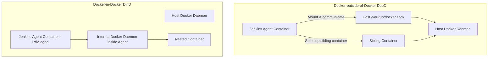

# Docker and Jenkins Integration

Integrating Docker with Jenkins combines the power of containerization with continuous integration, allowing you to use containers as execution environments, build container images dynamically, and publish those images to registries like Docker Hub or GitHub Container Registry (GHCR).

---

## 1. Building Docker Images using Jenkins

There are two primary ways to build a Docker image in a Jenkins pipeline: using raw shell commands (CLI) or using the **Docker Pipeline** plugin.

### Method A: Raw Shell Commands (Docker CLI)
If the Jenkins agent has the Docker CLI installed and access to a Docker daemon, you can run standard docker commands inside `sh` steps.

```groovy
pipeline {
    agent any
    stages {
        stage('Build Docker Image') {
            steps {
                echo 'Building image using Docker CLI...'
                // Build the image and tag it with the build number
                sh "docker build -t myapp:${env.BUILD_NUMBER} ."
            }
        }
        stage('Clean Local Images') {
            steps {
                // Good practice to clean up local build images to save disk space
                sh "docker rmi myapp:${env.BUILD_NUMBER}"
            }
        }
    }
}
```

### Method B: Using Docker Pipeline Plugin (Programmatic API)
The Docker Pipeline plugin provides a cleaner, Groovy-native syntax for managing images.

```groovy
pipeline {
    agent any
    stages {
        stage('Build Docker Image') {
            steps {
                script {
                    // Builds the Dockerfile in the current directory
                    def appImage = docker.build("myapp:${env.BUILD_NUMBER}")
                }
            }
        }
    }
}
```

---

## 2. Docker inside Jenkins Agents (DooD vs. DinD)

When running Jenkins agents inside containers, those agents often need to build and run *other* Docker containers. This is achieved using two main patterns: **Docker-outside-of-Docker (DooD)** and **Docker-in-Docker (DinD)**.



### A. Docker-outside-of-Docker (DooD) - Recommended
In this approach, the Jenkins Agent container does not run its own Docker daemon. Instead, it connects to the host machine's Docker daemon by mounting the host's Unix socket.

*   **Configuration**: Mount the host socket `/var/run/docker.sock` to the Agent container `/var/run/docker.sock` when launching the Agent.
*   **Pros**:
    *   **Shared Cache**: Reuses the host's Docker cache, making builds faster.
    *   **Lightweight**: No overhead of running multiple Docker daemons.
*   **Cons**:
    *   **Security Risk**: The Agent container has root access to the host's Docker daemon, allowing it to control, stop, or start any container on the host.

### B. Docker-in-Docker (DinD)
In this approach, a complete and isolated instance of the Docker daemon runs *inside* the Jenkins Agent container.

*   **Configuration**: The Agent container must be run with the `--privileged` flag.
*   **Pros**:
    *   **Isolation**: Completely isolated environment; build processes cannot interfere with the host OS or other containers.
*   **Cons**:
    *   **No Cache Sharing**: Cache is lost when the Agent container is destroyed (unless volumes are carefully mapped).
    *   **Security Concerns**: Running containers in `--privileged` mode presents significant security vulnerabilities.
    *   **Performance**: Overhead of running nested virtualization.

---

## 3. Using Docker Plugins

Jenkins offers plugins to simplify container integration:

### A. Docker Pipeline Plugin
This plugin allows you to define a Docker image as the execution environment for a specific stage or the entire pipeline. Jenkins automatically spins up the container, runs the steps inside it, and terminates the container when finished.

```groovy
pipeline {
    agent none // Do not allocate a global agent
    stages {
        stage('Build Java Code') {
            agent {
                docker { 
                    image 'maven:3.8.1-openjdk-17' 
                    args '-v /root/.m2:/root/.m2' // Cache maven dependencies on host
                }
            }
            steps {
                sh 'mvn clean package' // Runs inside the Maven container
            }
        }
        stage('Lint Node Code') {
            agent {
                docker { image 'node:16-alpine' }
            }
            steps {
                sh 'npm install && npm run lint' // Runs inside the Node container
            }
        }
    }
}
```

### B. Docker Plugin (Dynamic Cloud Agents)
Configured via **Manage Jenkins** -> **Nodes** -> **Clouds**.
*   Allows Jenkins to connect to a remote Docker daemon.
*   Dynamically spins up Docker containers as Jenkins agents when jobs are queued.
*   Terminates and destroys the containers once the builds are finished, ensuring a clean state for every build.

---

## 4. Publishing Images to Docker Hub & GHCR

Publishing images requires secure authentication. You must store credentials in Jenkins (**Manage Jenkins** -> **Credentials**) and bind them inside your pipeline.

### A. Publishing to Docker Hub
Using the standard `withCredentials` block to safely log in:

```groovy
pipeline {
    agent any
    environment {
        DOCKER_HUB_REPO = 'yourusername/myapp'
    }
    stages {
        stage('Build & Push to Docker Hub') {
            steps {
                // Bind Jenkins credentials securely
                withCredentials([usernamePassword(credentialsId: 'docker-hub-creds-id', usernameVariable: 'USER', passwordVariable: 'PASS')]) {
                    // Build
                    sh "docker build -t ${DOCKER_HUB_REPO}:${env.BUILD_NUMBER} ."
                    
                    // Secure Login
                    sh "echo ${PASS} | docker login -u ${USER} --password-stdin"
                    
                    // Tag and Push
                    sh "docker tag ${DOCKER_HUB_REPO}:${env.BUILD_NUMBER} ${DOCKER_HUB_REPO}:latest"
                    sh "docker push ${DOCKER_HUB_REPO}:${env.BUILD_NUMBER}"
                    sh "docker push ${DOCKER_HUB_REPO}:latest"
                }
            }
        }
    }
}
```

### B. Publishing to GitHub Container Registry (GHCR)
GHCR uses the domain `ghcr.io` and requires a GitHub Personal Access Token (PAT) with `write:packages` permission.

```groovy
pipeline {
    agent any
    environment {
        GHCR_REPO = 'ghcr.io/github-username/myapp'
    }
    stages {
        stage('Build & Push to GHCR') {
            steps {
                // Store your GitHub PAT as secret text credential in Jenkins
                withCredentials([string(credentialsId: 'github-pat-token-id', variable: 'PAT_TOKEN')]) {
                    sh "docker build -t ${GHCR_REPO}:${env.BUILD_NUMBER} ."
                    
                    // Log in to ghcr.io using the token
                    sh "echo ${PAT_TOKEN} | docker login ghcr.io -u github-username --password-stdin"
                    
                    // Push
                    sh "docker push ${GHCR_REPO}:${env.BUILD_NUMBER}"
                }
            }
        }
    }
}
```

### C. Using Docker Pipeline DSL for Registry Pushes
If using the Docker Pipeline plugin, you can use the native `withRegistry` block:

```groovy
stage('Push to Registry') {
    steps {
        script {
            // Log in and push image
            docker.withRegistry('https://registry.hub.docker.com', 'docker-hub-creds-id') {
                def myImage = docker.build("yourusername/myapp:${env.BUILD_NUMBER}")
                myImage.push()
                myImage.push("latest")
            }
        }
    }
}
```
